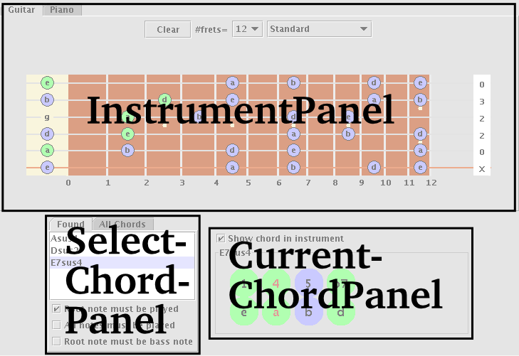
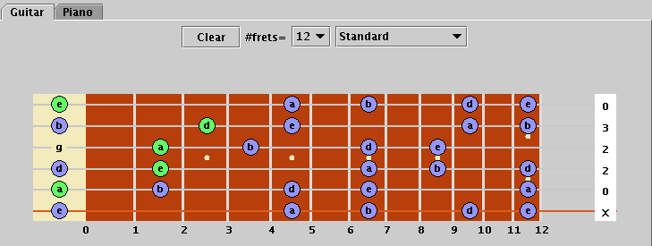
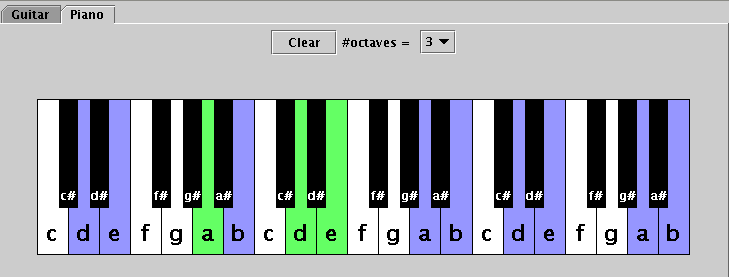
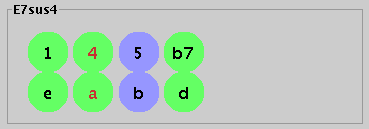
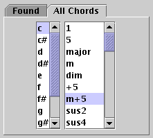
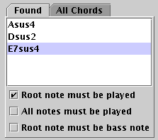
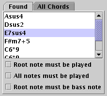
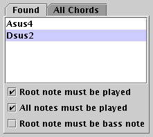
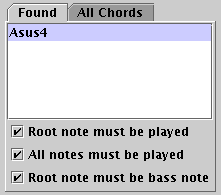

# ChordFinder Manual

## Introduction

The ChordFinder applet is intended to help find the names of chords
played on a guitar, bass or piano, as well as alternate positions for
this chord. "Playing" chords is done by clicking them in a
visualization of the instrument. There is a seperate section on [finding
chords](findingchords.md).

## Interface Manual

The ChordFinder applet should be displayed more or less as below. Its
three main components are:

- The [InstrumentPanel](#InstrumentPanel), which shows an instrument
    on which notes are displayed.
- [CurrentChordPanel](#CurrentChordPanel). This panel displays the
    current chord. The name of this chord is in its border, and a
    representation of this chord below.
- [SelectChordPanel](#SelectChordPanel). This panel allows you to
    choose the current chord. It also lists the chords currently played
    in the instrument.

## InstrumentPanel

This panel allows you to "play" notes on an instrument (in green), and
visualize notes from the chord in the ChordPanel (in blue). It either
displays the fretboard of a guitar, or the keyboard of a piano.

It is important to understand the difference between green and blue
notes (pun not intended). Green notes are manually specified through
clicking in the [InstrumentPanel](#InstrumentPanel), for instance on the
guitar's fretboard, or the piano's keyboard. These notes are
"played". Blue notes are not actually played, but are part of the
current chord displayed in the [CurrentChordPanel](#CurrentChordPanel).

### GuitarPanel

Strings can be strummed by clicking at a fret. The 0th fret is the nut.
The number of frets and the tuning can be chosen at the top of this
panel. Not strumming a string can be achieved by clicking in the tabs
notation to the right of the neck, where right handed guitar players
would normally strum. Pressing clear removes any notes played.

### PianoPanel

Essentially as the guitar panel, but then, well, a piano. The number of
octaves displayed can be varied.

## CurrentChordPanel

The name of the currently selected chord is displayed in this panel's
border. In the panel itself, a representation of the chord is shown in
two rows of circles. The name of the intervals (1,3,b7,\...) are listed
above, and the corresponding note (c,c3,d\#\...) below.

Green circles mean that this note is played in the chord found in the
[InstrumentPanel](#InstrumentPanel), and blue means it is not. Red
indicates that the note is the bass note (the note with the lowest
frequency) being played.

In the example below, the chord Esus4 is displayed. The
"e","a","b" notes of this chord are played in the instrument
panel, but the "b" is not. The bass note is "a". This corresponds to
the note being played in the InstrumentPanels abov.e

The "Show chord in instrument" determines whether or not the current
chord is displayed in the [InstrumentPanel](#InstrumentPanel).

## SelectChordPanel

In this panel, you can choose the current chord. It can be chosen from a
list of all chords, or a list of chords that match the notes played in
the [InstrumentPanel](#InstrumentPanel).

### AllChordsList

This panel lists all possible root notes (c..b) and most common chords.

### FoundChordsList

This tab lists the chords that match notes currently played in the
[InstrumentPanel](#InstrumentPanel). How these chords are found, and
what the checkboxes below this list mean is explained in the next
section on the page on [finding chords](findingchords.md).

### Filtering Chords

This section will probably not make much sense if you have not yet read
the page on [finding chords](findingchords.md), especially the section
on [filtering chords](findingchords.md#filteringchords).

Which chords are listed can be controlled with the check boxes below the
list.

1. All chords whose notes are a superset of the notes played are listed.

2. As 1), but the root note of the chord must be played.

3. As 2), but all notes of the chord must be played.

4. As 2), and the root note must be the bass note.

